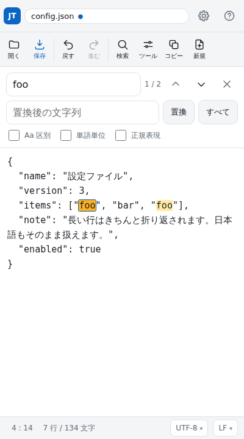
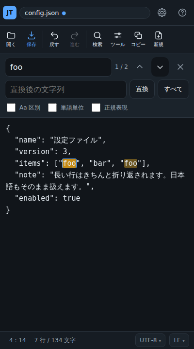
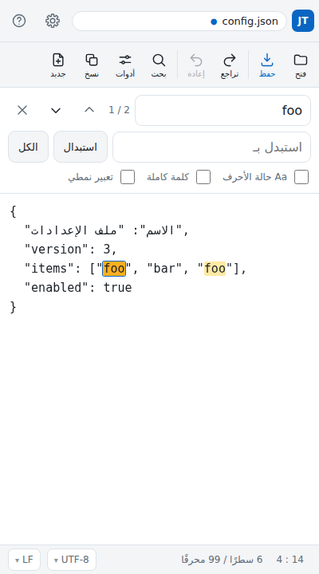

# InBrowser JustText

**▶ [https://masakiniwa.github.io/InBrowser-JustText/](https://masakiniwa.github.io/InBrowser-JustText/) — ブラウザで開いてすぐ使えます**

[English](README.md) | 日本語

ブラウザだけでテキストをいじって保存する、それだけのツール。

Android の標準機能では JSON や設定ファイルのようなテキストを編集できないことが多く、
そのためだけにアプリを入れたくない、という動機で作っています。
ファイルは端末の外に出ません。読み込みも保存もすべてブラウザの中で完結します。

<p>
  
  
</p>

## できること

- **開く** — 端末内のテキストファイルを読み込む。文字コードは自動判別（UTF-8 / Shift_JIS / EUC-JP / ISO-2022-JP / UTF-16 / Windows-1252）。バイナリらしいファイルは開く前に注意する
- **編集** — 元に戻す・やり直す、行番号、折り返しの切り替え、Tab でのインデント、改行時のインデント引き継ぎ
- **検索と置換** — 大文字小文字の区別、単語単位、正規表現（`$1` などの後方参照つき）、一致件数の表示と該当箇所の強調
- **保存** — 別ファイルとしてダウンロード。文字コードと改行コード（LF / CRLF / CR）、BOM の有無を選べる。保存できない文字があるときは、書き出す前に止めて選び直せる
- **上書き保存** — 対応しているブラウザでは、保存先を選んで既存のファイルへ上書きもできる（確認あり）
- **コピー** — 全文（選択中ならその範囲）をワンタップでクリップボードへ
- **自動保存と復元** — 編集中の内容を端末内に控え、次の起動時に復元するか尋ねる
- **ツール** — JSON の整形・最小化・検証、行の並べ替え、重複行の削除、行末の空白削除など
- **15 言語対応** — 端末の言語で自動的に切り替わり、設定からいつでも変更できる（アラビア語では画面が右から左になる）
- **オフライン動作** — ホーム画面に追加すれば、通信がなくても起動する
- **共有から起動** — Android の「共有」メニューからこのアプリを選ぶと、そのファイルを直接開ける

既定ではダウンロード保存なので、元のファイルは変更されません。
上書きしたいときだけ、明示的に上書き保存を選びます。

## 対応言語

端末の言語に合わせて自動で選ばれ、設定からいつでも変更できます。
対応していない言語の場合は英語で表示します。

| | | |
| --- | --- | --- |
| English | Français | Deutsch |
| Italiano | Español | Português |
| 日本語 | 简体中文 | 繁體中文 |
| 한국어 | हिन्दी | Bahasa Indonesia |
| Tiếng Việt | ไทย | العربية |

<p></p>

アラビア語では**画面（UI）が右から左に反転します**。
編集面は言語に関わらず左から右のままです。書字方向が変わると行番号や検索の強調表示の
位置合わせが崩れるためで、多くのコードエディタと同じ扱いです。
つまり対応しているのは「UI の RTL 化」であって、本文を右から左に組む機能ではありません。

**訳はすべて AI（Claude）が作成したものです。** 日本語を含め、人手による校正は入っていません。
おかしな言い回しを見つけたら `src/i18n/locales/` の該当ファイルを直してください。

リポジトリ本体（コード・コメント・テスト・ドキュメント）は英語で書いています。
日本語はドキュメントの第二言語という扱いで、この README と
[CHANGELOG.ja.md](CHANGELOG.ja.md) が英語版に追従します。
残る 14 言語はアプリ内の辞書にだけあり、ドキュメントは英語と日本語の 2 つです。

## 使い方

### Android で使う

1. 上のリンクを Chrome で開く
2. メニューから **ホーム画面に追加** を選ぶと、アプリとして起動できるようになります（オフラインでも動きます）
3. ファイル管理アプリなどでテキストファイルの **共有** から「JustText」を選ぶと、そのファイルを直接開けます

保存すると端末のダウンロードフォルダに保存されます。
同名のファイルがあれば `名前 (1).json` のように別名で保存されます。

### 自分で公開する（GitHub Pages）

ビルドは不要です。リポジトリをそのまま配信すれば動きます。

1. GitHub のリポジトリの **Settings → Pages** を開く
2. **Source** を「Deploy from a branch」、**Branch** を `main` / `/ (root)` にして保存
3. 数分後に `https://<ユーザー名>.github.io/<リポジトリ名>/` で開けるようになる

### 手元で動かす

ES モジュールを使っているため `file://` では動きません。付属の簡易サーバを使ってください。

```
npm run serve      # http://localhost:8080/
```

## キーボード操作

| 操作 | キー |
| --- | --- |
| 開く | `Ctrl` + `O` |
| 保存 | `Ctrl` + `S` |
| 検索 | `Ctrl` + `F` |
| 行へ移動 | `Ctrl` + `G` |
| 元に戻す / やり直す | `Ctrl` + `Z` / `Ctrl` + `Shift` + `Z` |
| 次を検索 / 前を検索 | 検索欄で `Enter` / `Shift` + `Enter` |
| インデント / 逆インデント | `Tab` / `Shift` + `Tab` |
| 検索を閉じる | `Esc` |

ソフトキーボードには `Ctrl` がないため、主要な操作はすべて画面のボタンからも実行できます。

## 文字コードについて

読み込み時は BOM、エスケープシーケンス、バイト列の妥当性、日本語らしさの度合いを順に見て判定します。
判定を間違えたときは、画面下部の `UTF-8 ▾` を押して指定し直せます（隣の `LF ▾` は保存時の改行コードです）。

保存できる文字コードは UTF-8 / UTF-16 / Shift_JIS / EUC-JP / Windows-1252 です。
ブラウザ内蔵の変換表から逆引き表を組み立てているため、変換表のずれは起きません。
選んだ文字コードで表せない文字があるときは、**保存する前に**その文字を一覧で示し、
「UTF-8 で保存」「? に置き換えて保存」「キャンセル」から選べます。

ISO-2022-JP は読み込みのみ対応しています（保存時は他の文字コードを選んでください）。

## 上書き保存について

既定は「別ファイルとしてダウンロード」です。元のファイルは触りません。

ブラウザが [File System Access API](https://developer.mozilla.org/docs/Web/API/File_System_API) に
対応している場合（主にパソコンの Chrome / Edge）は、保存ダイアログに次の 2 つが増えます。

- **保存先を選ぶ** — 場所とファイル名を選んで保存します。既存のファイルを選べば上書きになります
- **上書き保存** — 一度保存先を選んだあとに出ます。同じファイルへ直接書き込みます

上書きは元に戻せないため、実行前に必ず確認を挟みます。
対応していない環境（Android の Chrome など）では、これらのボタンは出ません。

## 自動保存と復元

編集中の内容は、入力が落ち着いたところで端末内（IndexedDB）に自動で控えられます。
タブを閉じた、端末がブラウザを終了させた、といった場合でも、
次に開いたときに「前回の続きがあります」と尋ねます。

- 控えが残るのは**未保存の変更があるあいだだけ**です。保存が済むと消えます
- 控えは端末の中だけに置かれ、外には出ません
- 保存できない環境（プライベートモードや容量不足）では黙って諦めます。
  あくまで保険なので、確実に残したいときは保存してください

## 開発

依存パッケージはありません。Node.js 22 以降で動きます。

```
npm test                     # 単体テスト
npm run serve                # 開発用サーバ
npm run test:browser         # ブラウザでの通し確認（要 Playwright / Chromium）
npm run test:browser:firefox # 同上を Firefox で
npm run test:browser:webkit  # 同上を WebKit で
```

通し確認は Chromium・Firefox・WebKit で動かしています。
ブラウザが対応していない次の 2 つは、その場合だけ飛ばします。

- **共有ターゲット** — Chromium 系（主に Android）だけの仕組みで、Safari には無い
- **オフラインの再現** — WebKit では自動操作から通信断を作れない

iOS Safari の実機、実機での共有、画面読み上げは自動では確かめられないため、
変更したときは実機でも触って確かめてください。

ブラウザ側の確認には Playwright が必要です。

```
npm i -D playwright && npx playwright install chromium
```

### 構成

```
index.html            画面の骨格
styles/app.css        見た目
sw.js                 Service Worker（オフライン動作・共有の受け取り）
manifest.webmanifest  ホーム画面への追加、共有ターゲットの定義
src/
  core/               DOM に依存しない処理。単体テストの対象
    encoding.js         文字コードの判別とデコード
    encoder.js          テキスト → バイト列（保存用）
    newline.js          改行コードの判別と変換
    search.js           検索と置換
    history.js          元に戻す / やり直す
    position.js         オフセット ⇔ 行・桁
    binary.js           バイナリらしさの判定
  i18n/               表示言語の切り替えと辞書（locales/ に言語ごとのファイル）
  io/                 ファイルの読み込み・保存・共有の受け取り・クリップボード・自動保存
  ui/                 画面まわり（エディタ、検索パネル、設定など）
  tools/              編集コマンドと、その登録簿
  util/               小さな道具
```

`core/` は DOM を触らないため、Node からそのまま読み込んでテストできます。
機能を足すときも、判断のいる処理はここに置くと確認が楽になります。

### 編集機能を足す

コマンドは `src/tools/registry.js` に登録すると、ツールメニューに自動で並びます。
用途に応じて 3 通りの書き方があります。

```js
import { register } from './registry.js';

// 1. 選択行（無選択なら全文）を変換する
register({
  id: 'text.upper',
  group: 'text',
  label: 'cmd.text.upper', // 辞書のキー。辞書に無ければそのまま表示される
  lineTransform: (text) => text.toUpperCase(),
});

// 2. 全文を変換する
register({
  id: 'text.reverse',
  group: 'text',
  label: 'cmd.text.reverse',
  transform: (text) => text.split('\n').reverse().join('\n'),
});

// 3. カーソル移動や通知など、細かく制御する
register({
  id: 'text.count',
  group: 'text',
  label: 'cmd.text.count',
  run: (ctx) => ctx.notify(`${ctx.getText().length} 文字`),
});
```

`ctx` から使えるもの:

| 名前 | 内容 |
| --- | --- |
| `getText()` / `setText(text, opts)` | 本文の取得と差し替え（差し替えは履歴に 1 手として積まれる） |
| `getSelection()` / `setSelection(start, end, { reveal })` | 選択範囲。`reveal` を付けるとその位置まで移動する |
| `applyToSelectedLines(fn, label)` | 選択行だけに変換をかける |
| `notify(message, type)` | 画面下部にメッセージを出す（`type` に `'error'` を指定可） |
| `settings` / `indentUnit()` | タブ幅などの設定 |
| `document` | 開いているファイルの情報（名前、文字コード、改行コード） |

ファイルを新しく追加したときは、オフラインでも読めるよう `sw.js` の `APP_SHELL` にも追加し、
`VERSION` を上げてください。

### 表示言語を追加する

1. `src/i18n/locales/en.js` を写して `src/i18n/locales/xx.js` を作り、値を訳す（キーはそのまま）
   - ファイル名は言語コードを小文字にしたもの（`zh-Hans` なら `zh-hans.js`）
2. `src/i18n/index.js` の `LOCALES` に 1 行足す

   ```js
   { code: 'sv', label: 'Svenska', dir: 'ltr' },
   ```

   `label` はその言語自身での表記、`dir` は書字方向（右から左なら `'rtl'`）です。
3. `sw.js` の `APP_SHELL` にファイルを追加し、`VERSION` を上げる

辞書は選ばれたときに読み込まれるため、言語が増えても起動時の読み込み量は変わりません。

`npm test` が次を確認します。

- どの言語も英語と同じキーが揃っているか
- `{name}` のような差し込みが言語間でずれていないか
- 画面に直接書かれた文言と英語の辞書が一致しているか
- 英語をそのまま貼っただけの未翻訳が残っていないか

訳が抜けているキーは英語、それも無ければキー名がそのまま表示されるので、
途中まででも画面は壊れません。

### 設計上の判断

- 編集面は素の `<textarea>`。Android の IME・選択ハンドル・カーソル操作をそのまま使えるのが理由です。
  検索の強調表示は、同じ字送りで文字を重ねた「鏡」レイヤーで行っています
  （`src/ui/editor.js`。この 2 つの字送りがずれると強調位置がずれるため、CSS では必ず同じ値を使ってください）
- 行番号は折り返しをオフにしたときだけ表示します。折り返し中は「1 行 = 1 表示行」が崩れ、行番号が揃わないためです
- 元に戻す操作はブラウザ標準の undo に頼らず自前で持っています。ソフトキーボードには `Ctrl` + `Z` がないためです
- 検索の現在位置はパネル側で保持しています。フォーカスが検索欄にある間、
  ブラウザが `textarea` の選択範囲を巻き戻すことがあり、それに影響されないようにするためです
- ファイル選択で拡張子を絞っていません。`.properties` や拡張子なしのファイルも開けるようにするためで、
  代わりに読み込み時にバイナリらしさを判定して注意します
- 右から左に書く言語でも、編集面だけは左から右に固定しています。
  書字方向が変わると鏡レイヤーと行番号の位置合わせが崩れるためで、
  多くのコードエディタと同じ扱いです

## そのほか

- [CHANGELOG.ja.md](CHANGELOG.ja.md) — 変更履歴（[English](CHANGELOG.md)）
- [README.md](README.md) — このページの英語版

## ライセンス

MIT License
