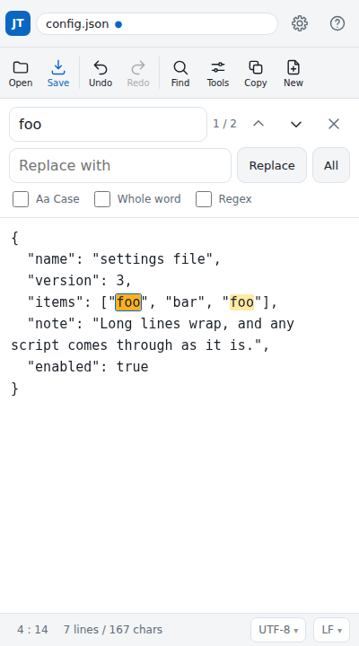
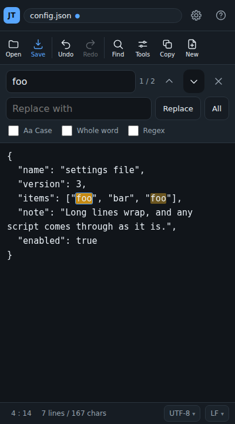

# InBrowser JustText

**▶ [https://masakiniwa.github.io/InBrowser-JustText/](https://masakiniwa.github.io/InBrowser-JustText/) — open it in a browser and start typing**

English | [日本語](README.ja.md)

Edit text in your browser and save it. Nothing more.

It exists because Android has no built-in way to edit a JSON or config file,
and installing an app just for that is a lot to ask.
Your files never leave the device — reading and saving both happen inside the browser.

<p>
  
  
</p>

## What it does

- **Open** — loads a text file from your device. The encoding is detected automatically
  (UTF-8 / Shift_JIS / EUC-JP / ISO-2022-JP / UTF-16 / Windows-1252), and files that look
  binary are flagged before they are opened
- **Edit** — undo and redo, line numbers, word wrap, Tab indentation, indent carried to the next line
- **Find and replace** — case-sensitive and whole-word matching, regular expressions with
  back references such as `$1`, a match counter and highlighted matches
- **Save** — downloads a separate file. You choose the encoding, the line ending (LF / CRLF / CR)
  and whether to add a BOM. If a character cannot be written in the chosen encoding, saving stops
  first and lets you decide
- **Overwrite** — where the browser supports it, you can pick a location and overwrite an
  existing file (with a confirmation)
- **Copy** — puts the whole document (or the selection) on the clipboard in one tap
- **Autosave and restore** — keeps a copy of your edits on the device and offers to bring them back
- **Tools** — format, minify and validate JSON, sort lines, remove duplicates, trim trailing spaces
- **15 languages** — follows the device language and can be changed at any time in settings (the interface mirrors right to left in Arabic)
- **Works offline** — add it to your home screen and it starts without a connection
- **Opens from Share** — on Android, share a file to this app to open it directly

Saving downloads a new file by default, so the original is never touched.
Overwriting only happens when you explicitly ask for it.

## Languages

The interface follows your device language and can be changed at any time in settings.
Anything not listed falls back to English.

| | | |
| --- | --- | --- |
| English | Français | Deutsch |
| Italiano | Español | Português |
| 日本語 | 简体中文 | 繁體中文 |
| 한국어 | हिन्दी | Bahasa Indonesia |
| Tiếng Việt | ไทย | العربية |

<p></p>

In Arabic **the interface mirrors right to left**. The editing area stays left to right
whatever the language: changing its writing direction would break the alignment between the
text, the line numbers and the search highlights — the same choice most code editors make.
So what is supported is a right-to-left *interface*, not right-to-left text layout in the
document itself.

**Every translation here was written by AI (Claude), Japanese included**, without human review.
If something reads badly, please correct the matching file in `src/i18n/locales/`.

The repository itself is written in English — code, comments, tests and docs. Japanese is kept
alongside it as a second language for the documentation: [README.ja.md](README.ja.md) and
[CHANGELOG.ja.md](CHANGELOG.ja.md) track this page and the changelog. The other fourteen
languages live in the app's own catalogs, not in the documentation.

## Using it

### On Android

1. Open the link above in Chrome
2. Choose **Add to Home screen** from the menu — it then launches like an app and works offline
3. In a file manager, **share** a text file and pick “JustText” to open it directly

Saved files go to your Downloads folder. If a file with the same name exists,
it is saved as `name (1).json`.

### Publishing your own copy (GitHub Pages)

No build step. Serving the repository as-is is enough.

1. Open **Settings → Pages** in the GitHub repository
2. Set **Source** to “Deploy from a branch” and **Branch** to `main` / `/ (root)`, then save
3. After a few minutes it is available at `https://<user>.github.io/<repo>/`

### Running it locally

ES modules do not load over `file://`, so use the bundled dev server.

```
npm run serve      # http://localhost:8080/
```

## Keyboard

| Action | Keys |
| --- | --- |
| Open | `Ctrl` + `O` |
| Save | `Ctrl` + `S` |
| Find | `Ctrl` + `F` |
| Go to line | `Ctrl` + `G` |
| Undo / Redo | `Ctrl` + `Z` / `Ctrl` + `Shift` + `Z` |
| Find next / previous | `Enter` / `Shift` + `Enter` in the search box |
| Indent / outdent | `Tab` / `Shift` + `Tab` |
| Close find | `Esc` |

Soft keyboards have no `Ctrl`, so every important action also has an on-screen button.

## About encodings

When reading, the BOM, escape sequences, byte validity and how much the result looks like
real text are checked in that order. If the guess is wrong, tap `UTF-8 ▾` at the bottom of
the screen to reopen with another encoding (`LF ▾` next to it is the line ending used when saving).

Files can be written as UTF-8, UTF-16, Shift_JIS, EUC-JP or Windows-1252.
The reverse tables are built from the browser's own decoder, so they cannot drift out of sync.
If the chosen encoding cannot represent some characters, they are listed **before** anything is
written, and you can choose “Save as UTF-8”, “Save with ?” or “Cancel”.

ISO-2022-JP can be read but not written — pick another encoding when saving.

## About overwriting

The default is “download as a separate file”. The original file is left alone.

If the browser supports the
[File System Access API](https://developer.mozilla.org/docs/Web/API/File_System_API)
(mainly Chrome and Edge on the desktop), two more buttons appear in the save dialog:

- **Choose location** — pick a folder and file name. Picking an existing file overwrites it
- **Overwrite** — appears once a location has been chosen; writes straight back to the same file

Overwriting cannot be undone, so it always asks for confirmation first.
On browsers without the API (Chrome on Android, for example) these buttons are not shown.

## Autosave and restore

Shortly after you stop typing, your edits are copied to on-device storage (IndexedDB).
If the tab closes, or the system shuts the browser down, the next launch offers to bring
that work back.

- The copy exists **only while there are unsaved changes**; saving clears it
- It never leaves the device
- Where storage is unavailable (private browsing, no quota) it quietly gives up.
  It is a safety net, not a substitute for saving

## Development

No dependencies. Node.js 22 or newer.

```
npm test                     # unit tests
npm run serve                # dev server
npm run test:browser         # full run in a browser (needs Playwright / Chromium)
npm run test:browser:firefox # the same run in Firefox
npm run test:browser:webkit  # the same run in WebKit
```

The browser run covers Chromium, Firefox and WebKit. Two checks are skipped where the
browser does not support the feature:

- **Share target** — a Chromium (mainly Android) capability that Safari does not implement
- **Offline emulation** — automation cannot cut the connection in WebKit

Real iOS Safari, sharing on a real device and screen readers are outside what automation
reaches, so try changes on a device as well.

Editing the README or the changelog means editing both halves: `npm test` checks that
`README.md`/`README.ja.md` and `CHANGELOG.md`/`CHANGELOG.ja.md` exist, link to each other, and
cover the same releases.

The browser run needs Playwright:

```
npm i -D playwright && npx playwright install chromium
```

### Layout

```
index.html            page skeleton
styles/app.css        styling
sw.js                 service worker (offline support, receiving shared files)
manifest.webmanifest  home-screen install and the share target
src/
  core/               DOM-free logic, covered by the unit tests
    encoding.js         encoding detection and decoding
    encoder.js          text → bytes, for saving
    newline.js          line-ending detection and conversion
    search.js           find and replace
    history.js          undo and redo
    position.js         offset ⇔ line and column
    binary.js           "does this look binary?"
  i18n/               language switching and the string catalogs (one file per language in locales/)
  io/                 reading, saving, share target, clipboard, autosave
  ui/                 editor, search panel, settings and the rest of the screen
  tools/              editing commands and their registry
  util/               small helpers
```

Everything under `core/` avoids the DOM, so Node can import it directly in tests.
When adding a feature, putting the decisions there keeps them easy to verify.

### Adding an editing command

Commands registered in `src/tools/registry.js` show up in the Tools menu automatically.
There are three shapes, depending on what the command needs:

```js
import { register } from './registry.js';

// 1. transform the selected lines (or the whole document when nothing is selected)
register({
  id: 'text.upper',
  group: 'text',
  label: 'cmd.text.upper', // a catalog key; unknown keys are shown as-is
  lineTransform: (text) => text.toUpperCase(),
});

// 2. transform the whole document
register({
  id: 'text.reverse',
  group: 'text',
  label: 'cmd.text.reverse',
  transform: (text) => text.split('\n').reverse().join('\n'),
});

// 3. take full control — move the cursor, show a message, and so on
register({
  id: 'text.count',
  group: 'text',
  label: 'cmd.text.count',
  run: (ctx) => ctx.notify(`${ctx.getText().length} characters`),
});
```

What `ctx` offers:

| Name | Purpose |
| --- | --- |
| `getText()` / `setText(text, opts)` | read and replace the document (a replacement becomes one undo step) |
| `getSelection()` / `setSelection(start, end, { reveal })` | the selection; `reveal` also scrolls there |
| `applyToSelectedLines(fn, label)` | apply a transform to the selected lines only |
| `notify(message, type)` | show a message at the bottom (`type` may be `'error'`) |
| `settings` / `indentUnit()` | tab width and related settings |
| `document` | the open file's name, encoding and line ending |

When you add a new file, list it in `APP_SHELL` in `sw.js` and bump `VERSION`
so it is still available offline.

### Adding a language

1. Copy `src/i18n/locales/en.js` to `src/i18n/locales/xx.js` and translate the values, keeping the keys
   - Name the file after the language code in lowercase (`zh-Hans` becomes `zh-hans.js`)
2. Add one line to `LOCALES` in `src/i18n/index.js`

   ```js
   { code: 'sv', label: 'Svenska', dir: 'ltr' },
   ```

   `label` is the language's own name for itself; `dir` is its writing direction (`'rtl'` if it
   reads right to left).
3. Add the file to `APP_SHELL` in `sw.js` and bump `VERSION`

Catalogs load on demand, so adding languages does not slow down startup.

`npm test` checks that:

- every language has the same keys as English
- placeholders such as `{name}` match across languages
- the text written directly in the HTML agrees with the English catalog
- no string was left as a copy of the English original

A missing key falls back to English, then to the key itself, so a partial translation
still leaves a working screen.

### Design notes

- The editing surface is a plain `<textarea>`, so Android's IME, selection handles and caret
  behave exactly as the platform intends. Search highlighting is drawn on a mirror layer whose
  text metrics match the textarea character for character (`src/ui/editor.js`) — if those two
  ever differ, the highlights drift, so keep the CSS values identical
- Line numbers appear only when wrapping is off. With wrapping on, one line is no longer one
  visual row, and the numbers cannot line up
- Undo is implemented in the app rather than relying on the browser's own, because soft
  keyboards have no `Ctrl` + `Z`
- The search panel keeps its own idea of the current match. While focus is in the search box,
  the browser can roll back the `textarea` selection, and replacing must not depend on that
- The file picker does not filter by extension, so `.properties` and extensionless files can be
  opened. Instead, files that look binary are flagged when they are read
- Even in right-to-left languages the editing area stays left to right. Changing the writing
  direction would break the alignment between the mirror layer, the line numbers and the text —
  the same choice most code editors make

## Also here

- [CHANGELOG.md](CHANGELOG.md) — what changed and when ([日本語](CHANGELOG.ja.md))
- [README.ja.md](README.ja.md) — this page in Japanese

## License

MIT License
